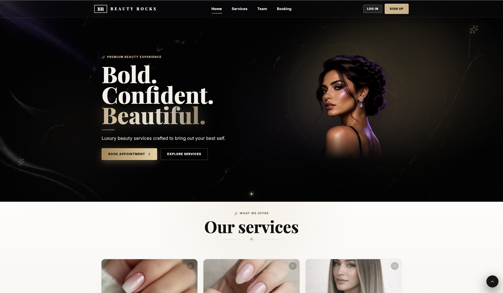
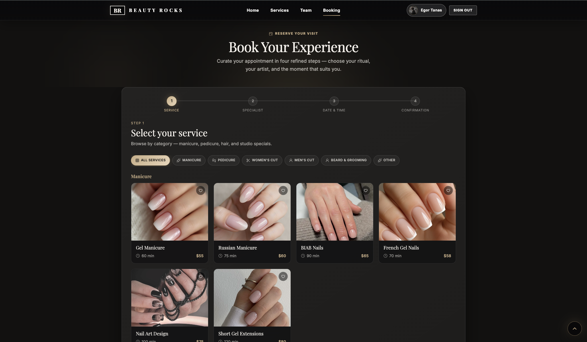
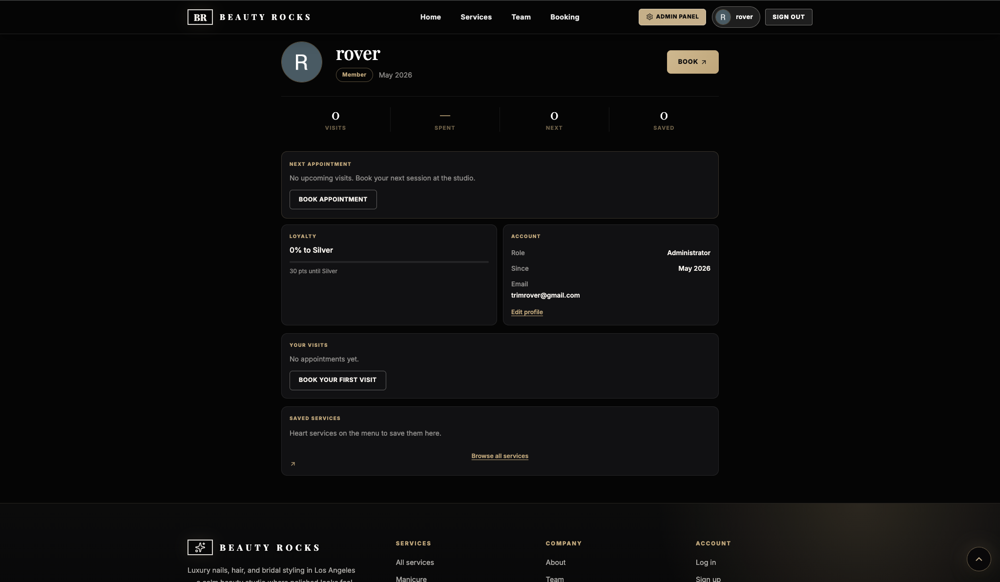
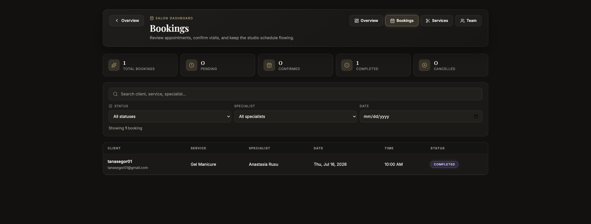
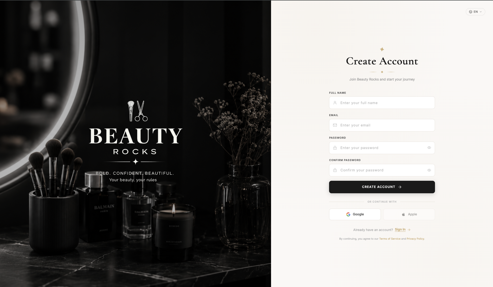

# Beauty Rocks

A modern full-stack web application for beauty salon booking and management.

## Live Demo

- Frontend: [beauty-rocks-s8ja-snowy.vercel.app](https://beauty-rocks-s8ja-snowy.vercel.app)
- Backend API: [beauty-rocks-api.onrender.com](https://beauty-rocks-api.onrender.com)

## Features

- User authentication (Email & Google OAuth)
- Online booking system
- User profile management
- Admin dashboard
- Email notifications
- Telegram bot integration
- Responsive design

## Screenshots

| Home | Booking | Profile |
| --- | --- | --- |
|  |  |  |

| Admin Dashboard | Login |
| --- | --- |
|  |  |

## Tech Stack

### Frontend

- React
- Vite
- React Router
- Framer Motion

### Backend

- Node.js
- Express
- MongoDB
- Mongoose

### Other

- JWT
- Passport
- Resend
- Telegram Bot API
- Cloudinary

## Repository Structure

```text
/
├── client/   # React frontend
└── server/   # Express API
```

## Run Locally

```bash
git clone https://github.com/EgorTanas/Beauty-Rocks.git
cd Beauty-Rocks
npm install
cd server && npm install
cd ../client && npm install
```

Backend:

```bash
cd server
npm run dev
```

Frontend:

```bash
cd client
npm run dev
```

## Architecture

```text
React (Frontend)
       │
       ▼
Express REST API
       │
       ▼
MongoDB
```

## Project Purpose

Beauty Rocks is a team project created to simulate a real-world beauty salon management platform with authentication, online bookings, admin management, and automated notifications.


